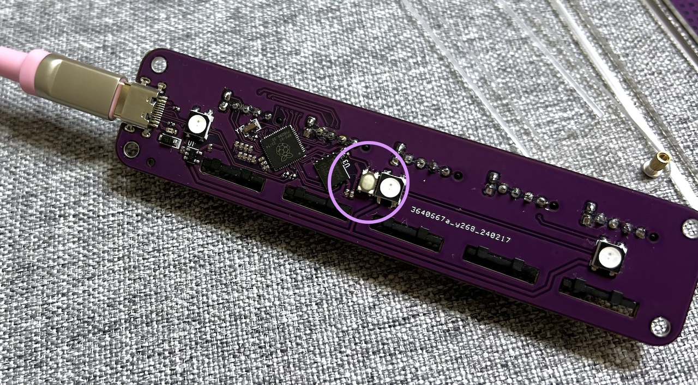

# Wheel con 取り扱い説明書([English](README_EN.md))

## 内容品
- Wheel con... 1個
- 着せ替えプレート... 1個
- ゴム足... 4個

## ご用意いただくもの
- Type-C USBケーブル
- Windows/Mac/Linux（iPad、Androidでも使用できますが設定ができません）

## 使用方法
Wheel conに動作ソフト（ファームウェア）を書き込みます。

Wheel conをPCに接続するとRPI-RP2というドライブとして認識されます。  

こちらのファイルをダウンロードしてそこにドラッグ&ドロップしてください。
- [tarohayashi_wheel_con_via.uf2](https://github.com/Taro-Hayashi/wheelcon/releases/latest/download/tarohayashi_wheel_con_via.uf2)

自動的にRPI-RP2ドライブが消えたら使用する準備は完了です。

お好みでプレートを変更したりゴム足を付けたりすることができます。

## キーのカスタマイズ
キーのカスタマイズにはRemapをご利用いただけます。
- https://remap-keys.app

接続するとこのような画面になるので、入れ替えたいキーをドラッグ&ドロップしてFlashボタンを押すと設定が変更されます。

## Cintiq Pro用インチネジ取付部品の使い方

### 内容品
- ケース部品 ...2
- 取手付きインチネジ ...1

### 取り付け方法
裏面のネジを外しプリント部品を除きます。

ケース部品を元のネジで取り付けます。上下を変えることでUSBケーブルの出し方を選ぶことができます。

取手付きのネジでCintiq Proに取り付けます。

## その他
### ファームウェアの更新方法
一番上のホイールを押し込みながらPCに接続するとRPI-RP2ドライブが出てくるのでそちらに新しいファームウェアをドラッグ&ドロップしてください。

### 出荷状態へのリセット方法
ねじを外して分解し、裏面のボタンを押しながらPCに接続するとRPI-RP2ドライブが出てきます。

こちらのページの一番下の項目からflash_nuke.uf2をダウンロードしてドラッグアンドドロップしてください。
- https://www.raspberrypi.com/documentation/microcontrollers/raspberry-pi-pico.html

一旦ドライブが消え、また現れたらリセット完了です。

### ファームウェアのソースコード
- https://github.com/Taro-Hayashi/qmk_firmware/tree/tarohayashi/keyboards/tarohayashi/wheel_con

### 謝辞
このキーボードは原型師のCKB様のアイデアをもとに依頼を受けて製作しました。
- https://twitter.com/miku1596

### 販売サイト
- BOOTH https://tarohayashi.booth.pm/items/5553379
