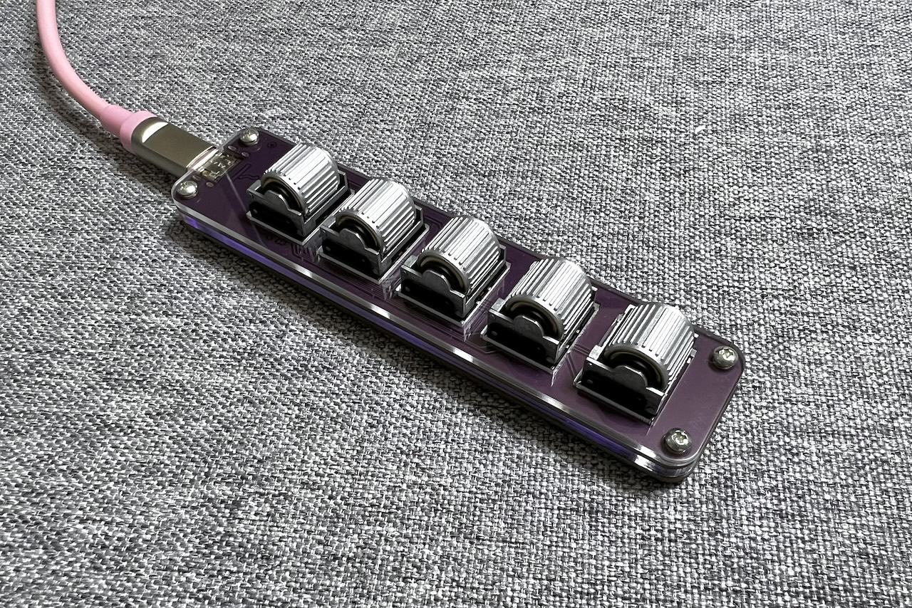

# Wheel con 取り扱い説明書  
  
## 内容品  
- Wheel con... 1個
- 着せ替えプレート... 1個
- ゴム足... 4個

## ご用意いただくもの  
- Type-C USBケーブル  
- Windows/Mac/Linux（iPad、Androiで使用はできますが設定ができません）  

## 使用方法
まずは動作ソフト（ファームウェア）をインストールします。  
PCに接続するとRPI-RP2というドライブとして認識されます。  
  

こちらのファイルをダウンロードしてドラッグアンドドロップしてください。  
- [tarohayashi_wheel_con_vial.uf2](https://github.com/Taro-Hayashi/wheelcon/releases/download/0.23/tarohayashi_wheel_con_vial.uf2)

自動的にRPI-RP2ドライブが消えたらファームウェアのインストール完了です。  

  
お好みでプレートを変更したりゴム足を付けたりして使ってください。  

## キーのカスタマイズ
キーのカスタマイズにはRemapかVialを利用します。使いやすい方をお選びください。  
- Remap https://remap-keys.app
- Vial https://vial.rocks

## その他
### ファームウェアの更新方法
一番上のホイールを押し込みながらPCに接続するとRPI-RP2ドライブが出てくるのでそちらに新しいファームウェアをドラッグアンドドロップしてください。  

### 出荷状態へのリセット方法
ねじを外して分解し、裏面のボタンを押しながらPCに接続するとRPI-RP2ドライブが出てきます。  
 

こちらのページの一番下の項目からflash_nuke.uf2をダウンロードしてドラッグアンドドロップしてください。  
- https://www.raspberrypi.com/documentation/microcontrollers/raspberry-pi-pico.html  
一旦ドライブが消え、また現れたらリセット完了です。

### ファームウェアのソースコード
- https://github.com/Taro-Hayashi/vial-qmk/tree/tarohayashi/keyboards/tarohayashi/wheel_con

### 謝辞
このキーボードは原型師のCKB様のアイデアをもとに依頼を受けて製作しました。  
- https://twitter.com/miku1596

### 販売サイト
- BOOTH 
